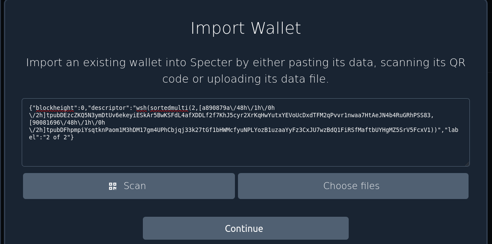
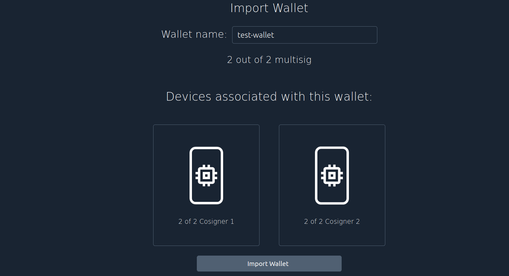
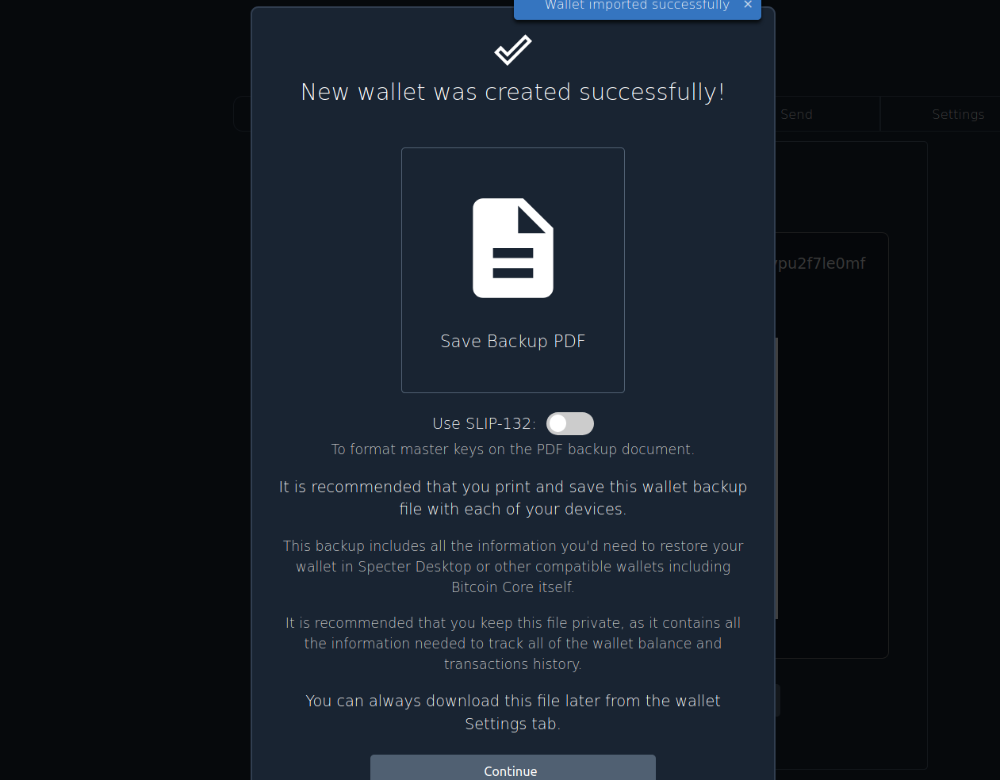
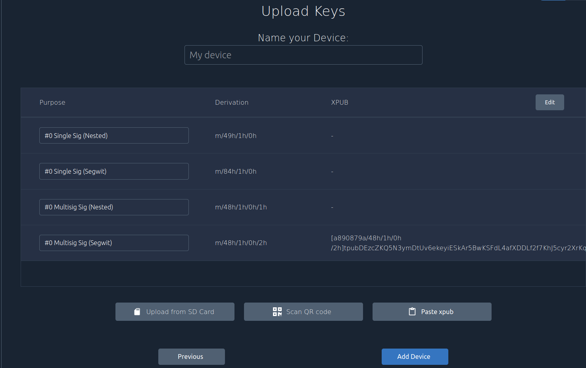
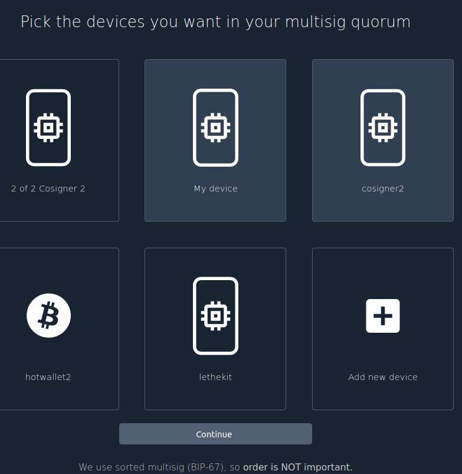
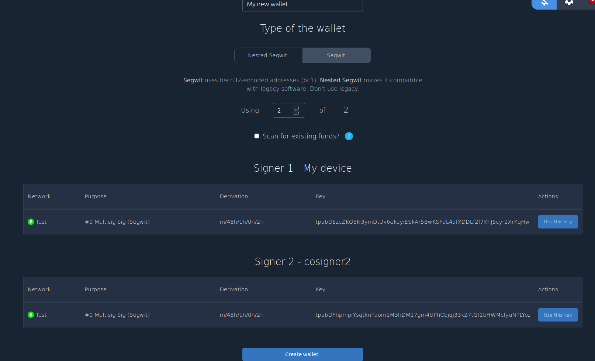
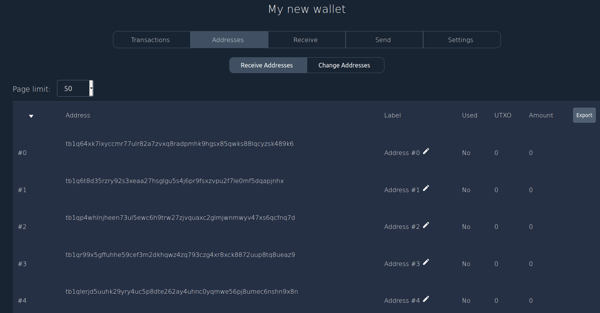
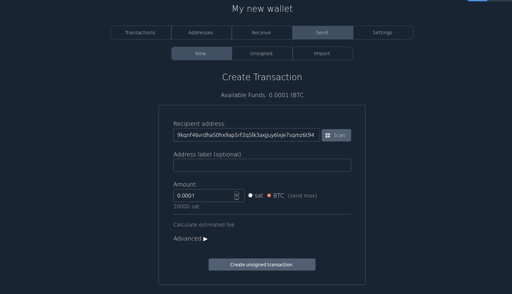
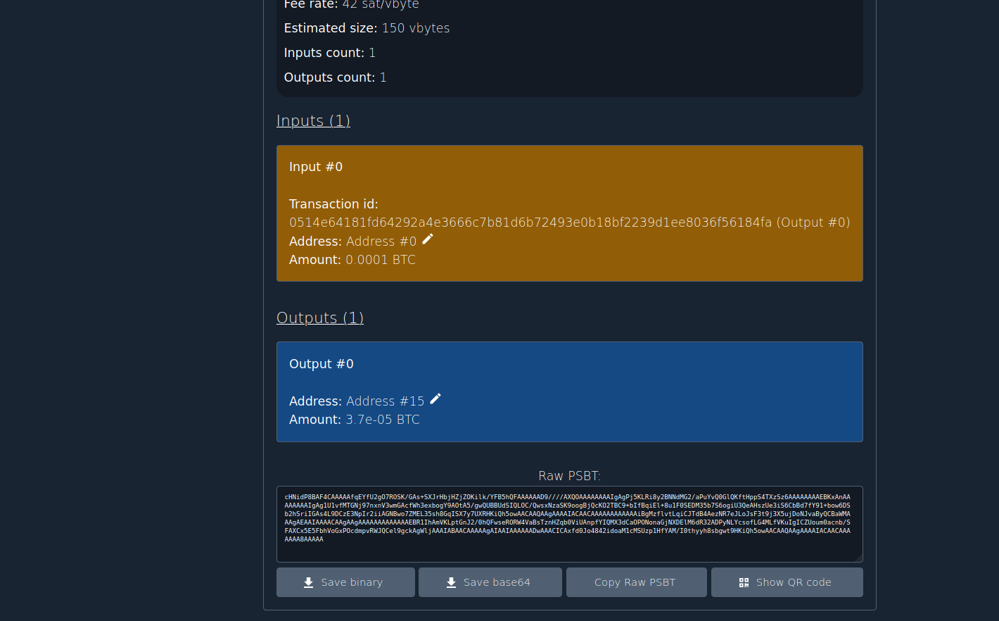
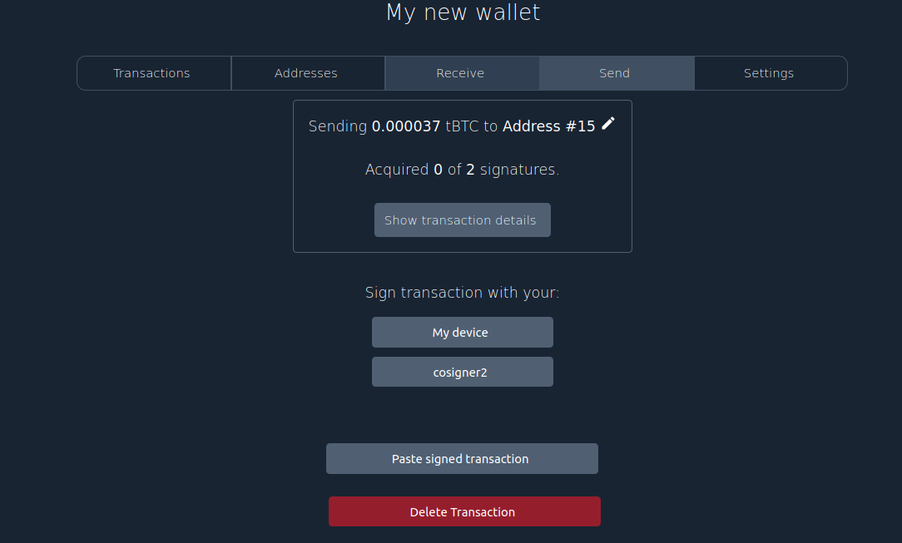

## Using Specter Desktop as Initiator & Finalizer

***Scenario Description:*** Specter Desktop acts as an Initiator and Finalizer; Gordian Cosigner acts as a cosigner; other users cosign by other means.

### Creating a Descriptor for Specter Desktop

There are two ways to create this descriptor: you can either export the "descriptor" from the **Accounts** tab of **Gordian Cosigner**, or you can export the individual origins and public keys from the **Cosigners** tab and build a complete descriptor on your own. 

Once you have creating a proper descriptor, you'll be able to use it for a variety of functions on Specter Desktop.


#### Creating a Descriptor from Accounts Information

The export function on the **Accounts** tab in **Gordian Cosigner** will produce text like the following:
```
{"blockheight":0,"descriptor":"wsh(sortedmulti(2,[a890879a\/48h\/1h\/0h\/2h]tpubDEzcZKQ5N3ymDtUv6ekeyiESkAr5BwKSFdL4afXDDLf2f7KhJ5cyr2XrKqHwYutxYEVoUcDxdTFM2qPvvr1nwaa7HtAeJN4b4RuGRhPSS83,[90081696\/48h\/1h\/0h\/2h]tpubDFhpmpiYsqtknPaom1M3hDM17gm4UPhCbjqj33k27tGf1bHWMcfyuNPLYozB1uzaaYyFz3CxJU7wzBdQ1FiRSfMaftbUYHgMZ5SrV5FcxV1))","label":"2 of 2"}
```
To use that descriptor with `Specter Desktop`, you must do the following:

Click **Add new wallet** -> **Import from wallet software** and paste the descriptor into the field:

 <br /><br />

Specter Desktop will automatically recognize the cosigners. Click **import wallet**.



On success, Specter Desktop will create a wallet and prompt you to backup it up.




#### Creating a Descriptor from Cosigners Information

Alternatively, you have everything you need in the **Cosigners** tab. You can go to each individual cosigner and incorporate all of that information to create your descriptor with Specter Desktop.

For example, look at the "Cosigner Detailer" for the first cosigner above and tap the "Text" button, which will give you an `xpub` that Specter Desktop can understand:
```
Origin:

a890879a/48h/1h/0h/2h

Public key:

tpubDEzcZKQ5N3ymDtUv6ekeyiESkAr5BwKSFdL4afXDDLf2f7KhJ5cyr2XrKqHwYutxYEVoUcDxdTFM2qPvvr1nwaa7HtAeJN4b4RuGRhPSS83
```
You'll need to repeat this for each cosigner:

Click **Add new device** -> **Paste xpub**

You'll have to paste the xpub in this form:

```
[a890879a/48h/1h/0h/2h]tpubDEzcZKQ5N3ymDtUv6ekeyiESkAr5BwKSFdL4afXDDLf2f7KhJ5cyr2XrKqHwYutxYEVoUcDxdTFM2qPvvr1nwaa7HtAeJN4b4RuGRhPSS83
```

On success, Specter will show the xpub in `Multisig Sig (Segwit)` section. Click **Add Device**.



After both cosigners are imported as devices, you can create a new wallet. Click **Add new wallet** -> **Multisignature wallet**. Specter will list all available devices (cosigners). You select your cosigners and click **Continue**.




<br /><br/>
In this section you choose your `wallet name`, `multisig quorum` and press **Create wallet**.




This should generate the same descriptor as created by **Gordian Cosigner**, but this methodology allows you to create it from the individual keys on your own.


### Testing Addresses on Specter Desktop

Open your wallet and click **Addresses**:




You can compare these in **Gordian Cosigner** by going to the **Accounts** tab, clicking the account in question and choosing "Address Explorer". Just click through the first few receive addresses; they should match the first few Bitcoin Core derived addresses.


### Creating PSBTs on Specter Desktop

You can use Specter Desktop to be a transaction coordinator, acting as an Initiator for your multisigs.

First, make sure to run the Blockchain rescan in **Settings** to see all of the available funds in your wallet


Next, click **Send** and fill out the `Recipient address`, `amount` and click **Create unsigned transaction**.



Specter Desktop will create a (raw) `PSBT` for you in `Transaction details`. It will offer you several options to export it into Gordian Cosigner. For example you can save it as a binary PSBT which can be imported into Gordian Cosigner.




Here's what that PSBT looks like:
```
cHNidP8BAF4CAAAAAfqEYfU2gO7ROSK/GAs+SXJrHbjHZjZOKilk/YFB5hQFAAAAAAD9////AXQOAAAAAAAAIgAgPj5KLRi8y2BNNdMG2/aPuYvQ0GlQKftHppS4TXzSz6AAAAAAAAEBKxAnAAAAAAAAIgAg1U1vfMTGNj97nxnV3wmGAcfWh3exbogY9AOtA5/gwQUBBUdSIQLOC/QwsxNzaSK9oogBjQcKO2TBC9+bIfBqiEl+8u1F0SEDM35b7S6ogiU3QeAHszUe3iS6CbBd7fY91+bow6DSb2hSriIGAs4L9DCzE3NpIr2iiAGNBwo7ZMEL35sh8GqISX7y7UXRHKiQh5owAACAAQAAgAAAAIACAACAAAAAAAAAAAAiBgMzflvtLqiCJTdB4AezNR7eJLoJsF3t9j3X5ujDoNJvaByQCBaWMAAAgAEAAIAAAACAAgAAgAAAAAAAAAAAAAEBR1IhAmVKLptGnJ2/0hQFwseRORW4VaBsTznHZqb0ViUAnpfYIQMX3dCaOPONonaGjNXDElM6dR32ADPyNLYcsofLG4MLfVKuIgICZUoum0acnb/SFAXCx5E5FbhVoGxPOcdmpvRWJQCel9gckAgWljAAAIABAACAAAAAgAIAAIAAAAAADwAAACICAxfd0Jo4842idoaM1cMSUzp1HfYAM/I0thyyh8sbgwt9HKiQh5owAACAAQAAgAAAAIACAACAAAAAAA8AAAAA
```

At this point you can go to the **Payments** tab in **Gordian Cosigner** and import this PSBT, and then you'll be given the opportunity to sign it.

### Finalizing PSBTs in Specter Desktop

Any networked wallet can send out the PSBT once everyone has signed it. In Specter Desktop you click **Paste signed transaction** and on success Specter will offer you to broadcast it.





Congratulations, you've finished the round-trip for a multisig PSBT, using **Gordian Cosigner** and Specter Desktop.
