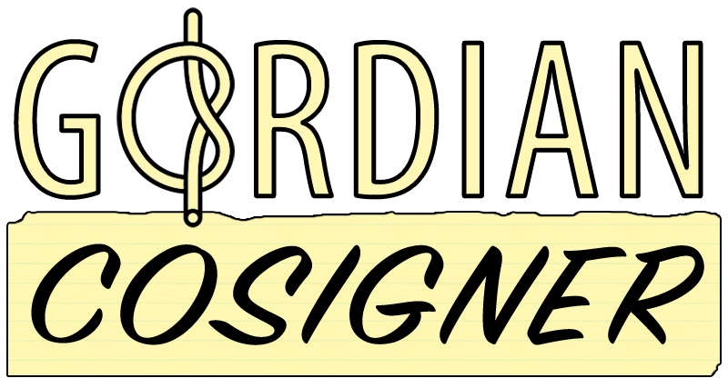

# Q&A about Gordian Cosigner



This document depends on a common [Glossary](./Glossary.md)

Why should you read or step through the Q&A? To get a different angle to the same topic: Gordian Cosigner.

**The questions are of a varied level: basic and detailed. The answers are mostly directed towards generally interested people and newbies.**\
*Q = one star question. Novice to Gordian Cosigner, advanced in DIDs\
**Q = two star question. Proficient in DIDs and advanced in Gordian Cosigner\
***Q = three star question. Expert in DIDs and proficient in Gordian Cosigner

```
{TBW} means: to be written
{TBW prio 1} means to be written with the highest priority, 3 = no urgency, 2 = intermediate}
```
- [Q&A about Gordian Cosigner](#qa-about-Gordian Cosigner)
    + [Disclaimer](#disclaimer)
    + [List of questions and definitions](#list-of-questions-and-definitions)
  * [Knowledge you should be confidently applying](#knowledge-you-should-be-confidently-applying)
  * [Actions you should be comfortable with](#actions-you-should-be-comfortable-with)
- [Jump table to categories](#jump-table-to-categories)


## Beware: A Q&A is always *work in progress*. Tips & help welcome.

### Disclaimer
None of the respondents in the **open** repo and presentations have been explicitly named as a source, except for ***Peter Denton***, ***Christopher Allen*** and ***@henkvancann***. If there is no reference added to the answers, then it's Christopher Allen who answered the question. Most of the editing is done by @henkvancann, which might have introduced ommission, errors, language glitches and such. Sorry for that, feel free to correct by submitting a pull request (PR).\
For practical reasons educational images uploaded by Github members have been downloaded. We de-personalised them by giving images a new name. Under these new names these images have been uploaded to github and used in the Q&A to clarify the questions and answers.

Gordian Cosigner's content is licensed under the [CC by SA 4.0. license](https://creativecommons.org/licenses/by-sa/4.0/). 

We've done our best to protect the privacy of the Github by investigating the images we used. We haven't come across personal identifiable information (pii). However, should we have made a mistake after all, please let us know and we'll correct this immediately.

### List of questions and definitions

- [Definitions:](#definitions)
      - [Cryptocurrency](./Glossary.md#cryptocurrency)
      - [Decentralized Identity](./Glossary.md#decentralized-identity)
      - [Entropy](./Glossary.md#entropy)
      - [Entity](./Glossary.md#entity)
      - [Inconsistency](./Glossary.md#inconsistency)
      - [Identity](./Glossary.md#identity)
      - [Key](./Glossary.md#key)
      - [Payload](./Glossary.md#payload)
      - [Public Key Infrastructure](./Glossary.md#public-key-infrastructure)
      - [Root of trust](./Glossary.md#root-of-trust)
      - [Secret](./Glossary.md#secret)
      - [Transfer](./Glossary.md#transfer)
      - [Trust-over-IP](./Glossary.md#trust-over-ip)
      - [Validator](./Glossary.md#validator)
      - [Verifiable Credential](./Glossary.md#verifiable-credential)
      - [W3C DID](./Glossary.md#w3c-did)
      - [(Digital Identity) Wallet](./Glossary.md#-digital-identity--wallet)


<small><i><a href='http://ecotrust-canada.github.io/markdown-toc/'>Table of contents generated with markdown-toc</a></i></small>

## Knowledge you should be confidently applying
- The definitions in the [glossary](./Glossary.md)
- Public private key pairs
- Hashing and hashes
- Signatures and Seeds
- W3C DIDs
## Actions you should be comfortable with
- Amend knowledge and keep existing knowledge up to date
- create a key pair safely and back it up safely
- sweep to a new wallet

# Jump table to categories
- [General](#qa-section-general)
- [Wallets](#qa-section-wallets)
- [Signatures](#qa-section-signatures)
- [Proofs](#qa-section-proofs)
- [Private Key Management](#qa-section-private-key-management)
- [Blockchain](#qa-key-blockchain)
- [Root of trust](#qa-section-root-of-trust)
- [Gordian Cosigner operational](#qa-section-Gordian-Cosigner-operational)
- [Agencies](#qa-key-agencies)
- [Virtual Credentials](#virtual-credentials)

# Q&A section General

## *Q: What is Gordian Cosigner?
An offline signing tool for multisignatures.
Gordian Cosigner allows users to participate in a multisig by adding a signature to an otherwise unsigned or partially signed `PSBT` that was created on another device.


## *Q: What is a PBST?
Partially signed bitcoin transactions (PSBTs) Also covering BIP174. Partially Signed Bitcoin Transactions (PSBTs) are a data format that allows wallets and other tools to exchange information about a Bitcoin transaction and the signatures necessary to complete it. 


## *Q: For who is Gordian Cosigner?
It's largely intended as an offline signing tool, which allows signing without a direct connection to a full node: a wallet that can create `PSBT`s or another transaction coordinator service is needed to initiate a transaction.

## *Q: WHy should I use Gordian Cosigner?
(Partially) Sign multisignature transactions offline.\
Gordian Cosigner can also be used for signing a single-signature `PSBT`, though that's not its main purpose.

## **Q: When should I use Gordian Cosigner?
Gordian Cosigner supports the middle step of multisig signing, after a multisig has been Initiated, while it is being Cosigned, and before it is Finalized. Usually, it will be used by a cosigner holding one of the keys used in a multisig account transaction before handing it back to another user for finalization.

# Q&A section Gordian Cosigner operational

## *Q On what platform or devices does Gordian Cosigner run?
Gordian Cosigner is a multiplatform utility that's also available as:
- [GordianCosigner for Android](https://github.com/BlockchainCommons/GordianSigner-Android)
- [GordianCosigner for MacOS](https://github.com/BlockchainCommons/GordianSigner-macOS)

## *Q: What do I need to run Gordian Cosigner? 
Currently (Feb 2021), Cosigner only runs in Testflight on iOS 14.4. So yu need to get a invitation code first from Blockchaincommons.

## **Q: How do I run Gordian Cosigner?
To prepare Gordian Cosigner for usage, you must first create a copy of the multisig that is being used. This is done by defining an account containing all of the cosigners in the multisig. The user of Gordian Cosigner will typically have a private key or seed for his own cosigner element, and then will typically be given an account map for the multisig and/or xpubs or QR codes for other users' cosigner elements. When he imports the account map or combines the cosigners into an account, it should match the multisig created by other people on their own wallets. (See our [Scenarios](https://github.com/BlockchainCommons/GordianCosigner-Catalyst/blob/master/Docs/Scenarios.md) page for more discussion of how Gordian Cosigner might be used.)